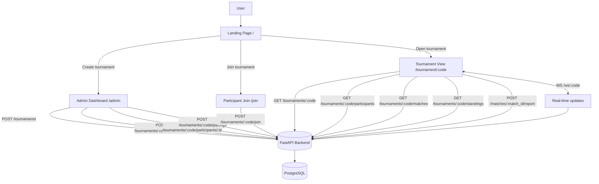
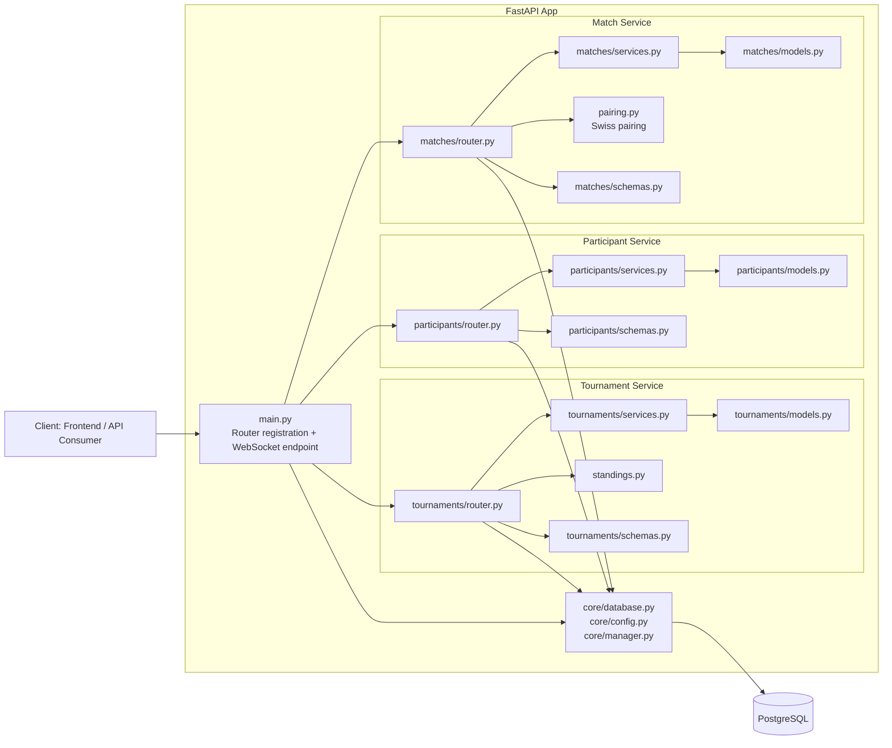

# Service Diagrams

## User Experience Diagram

```mermaid
flowchart TD
    U[User] --> LP[Landing Page /]
    LP -->|Create tournament| AD[Admin Dashboard /admin]
    LP -->|Join tournament| PJ[Participant Join /join]
    LP -->|Open tournament| TV[Tournament View /tournament/:code]

    AD -->|POST /tournaments| B[(FastAPI Backend)]
    AD -->|POST /tournaments/:code/participants| B
    AD -->|DELETE /tournaments/:code/participants/:id| B
    AD -->|POST /tournaments/:code/pairings| B

    PJ -->|POST /tournaments/:code/join| B

    TV -->|GET /tournaments/:code| B
    TV -->|GET /tournaments/:code/participants| B
    TV -->|GET /tournaments/:code/matches| B
    TV -->|GET /tournaments/:code/standings| B
    TV -->|POST /matches/:match_id/report| B
    TV <-->|WS /ws/:code| WS[Real-time updates]
    WS --> B

    B --> DB[(PostgreSQL)]
```

## Backend Service Diagram

```mermaid
flowchart LR
    C[Client: Frontend / API Consumer]

    subgraph API[FastAPI App]
        M[main.py\nRouter registration + WebSocket endpoint]

        subgraph TS[Tournament Service]
            TR[tournaments/router.py]
            TVS[tournaments/services.py]
            ST[standings.py]
            TM[tournaments/models.py]
            TSC[tournaments/schemas.py]
        end

        subgraph PS[Participant Service]
            PR[participants/router.py]
            PVS[participants/services.py]
            PM[participants/models.py]
            PSC[participants/schemas.py]
        end

        subgraph MS[Match Service]
            MR[matches/router.py]
            MVS[matches/services.py]
            PA[pairing.py\nSwiss pairing]
            MM[matches/models.py]
            MSC[matches/schemas.py]
        end

        CORE[core/database.py\ncore/config.py\ncore/manager.py]
    end

    C --> M
    M --> TR
    M --> PR
    M --> MR

    TR --> TVS
    TR --> ST
    TR --> TSC
    PR --> PVS
    PR --> PSC
    MR --> MVS
    MR --> PA
    MR --> MSC

    TVS --> TM
    PVS --> PM
    MVS --> MM

    TR --> CORE
    PR --> CORE
    MR --> CORE
    M --> CORE

    CORE --> PG[(PostgreSQL)]
```
